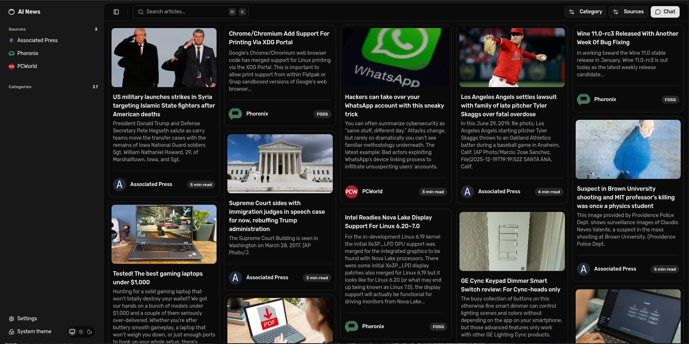

# 📰 Smart News Digest (MVP / POC)

> **AI-powered news summarization & analysis for busy professionals**

A lightweight, high-performance AI news assistant that aggregates articles from user-selected RSS feeds, provides intelligent summaries, supports **RAG-based querying**, and enables **deep per-article analysis** — all while prioritizing **speed, reliability, and usability**.

---

## ✨ Key Highlights

* 🚀 Blazingly fast, offline-tolerant frontend
* 🧠 RAG-based AI querying with hallucination safeguards
* ⌨️ Power-user friendly (extensive keyboard shortcuts)
* 🌙 Dark mode & clean, modern UI
* 📡 Real-time AI streaming via Server-Sent Events (SSE)
* 🧩 Scalable architecture, MVP-first design

---

## 📸 Preview

[`Full quality Google Drive Link`](https://drive.google.com/file/d/1QjobvwF2uPu272tIWasJx3fA6kZsZqdZ/view)

<iframe id="ucc-17" src="https://youtube.googleapis.com/embed/?autohide=1&amp;ps=docs&amp;enablecastapi=0&amp;hl=en&amp;partnerid=30&amp;post_message_origin=https%3A%2F%2Fdrive.google.com&amp;origin=https%3A%2F%2Fdrive.google.com&amp;hbenv=apps-elements&amp;enablejsapi=1" frameborder="0" width="100%" height="100%" allow="autoplay" title="YouTube video player"></iframe>

## 📸 Screenshots & UI Walkthrough

> *A quick visual walkthrough of the app, from discovery → reading → AI analysis → management → mobile experience.*

---

### 1️⃣ Landing Experience (First Impression)

**Landing Page — Masonry Feed (Desktop)**
*Scannable, fast-loading article feed optimized for discovery*



---

### 2️⃣ Reading Experience (Core Value)

**Article View — Clean & Distraction-Free (Desktop)**
*Ad-free, readable article layout with focus on content*

```md

```

```md

```

---

### 3️⃣ AI Chat — General Intelligence

**General AI Chat (Desktop)**
*Broad questions across multiple feeds & categories*

```md

```

**Context Picker — Adding Sources, Categories & Articles (Desktop)**
*On-the-fly context control without breaking flow*

```md

```

**Filtered Context — Source & Category Aware Chat (Desktop)**
*Only relevant articles are fed to the AI*

```md

```

**Natural Language Queries (Desktop)**
*Human-friendly prompts with streaming responses*

```md

```

---

### 4️⃣ AI Chat — Deep Article Analysis (Differentiator)

**Article Chat Mode — Deep Analysis (Desktop)**
*Automatic switch from “General” to “Article” mode*

```md

```

```md

```

---

### 5️⃣ Power-User Controls & Management

**Feed Management (Desktop)**
*Subscribe, organize, and manage RSS feeds*

```md

```

```md

```

**Category Management (Desktop)**
*Custom categorization for better signal-to-noise*

```md

```

**Source & Category Filters (Desktop)**
*Instant filtering shared between Feed & Chat*

```md

```

---

### 6️⃣ Responsive Design (Mobile Experience)

> *All screenshots below are from an **iPhone 14 Pro Max***

```md

```

```md

```

```md

```

```md

```

```md

```

---

### 7️⃣ Theme Support (Polish)

**Light Theme (Desktop)**
*Fully theme-aware UI with dark & light mode support*

```md

```

```md

```

---

## 🧩 Features

### 🖥 Frontend (React + shadcn/ui)

* Article listing with:

  * Title
  * Description
  * Source
  * Category
  * Estimated read time
* Clean, distraction-free article view (no ads, no tracking)
* **General AI Query Interface**, e.g.:

  * *“Summarize today’s tech news”*
  * *“What happened in sports this week?”*
* **Deep per-article AI analysis**
* RSS feed & category subscription management
* Fully responsive UI with filtering support
* Keyboard shortcuts for all common actions

---

## ⌨️ Keyboard Shortcuts

| Shortcut       | Action                                              |
| -------------- | --------------------------------------------------- |
| `Ctrl + K`     | Global search (articles / feeds / categories)       |
| `Ctrl + B`     | Toggle sidebar                                      |
| `Ctrl + ;`     | Toggle chat                                         |
| `Ctrl + J`     | Add context to chat (sources, categories, articles) |
| `Ctrl + Enter` | Send chat message                                   |

---

## 🛠 Tech Stack

### Frontend

* **React 19** (React Compiler enabled)
* **shadcn/ui** + Tailwind CSS
* **@tanstack/react-query** — client-side caching with stale & GC mechanics
* **markdown-to-jsx** — Performamt markdown rendering for chat & articles
* **react-masonry-css** — performant Masonry layouts

### Backend

> See [`backend/README.md`](https://github.com/Mouly-K/AI-News-Backend) for architecture, RAG pipeline, embeddings, and AI integration details.

---

## ⚙️ Installation

```bash
# Clone the repository
git clone https://github.com/Mouly-K/AI-News-Frontend.git

# Install dependencies
npm install

# Start the development server
npm run dev
```

> 📘 Detailed setup instructions can be found in the dedicated installation guide.

---

## 🧠 Design Philosophy

This project was built with a simple guiding question:

> *“Would I actually use this every day?”*

That translates to:

* Zero UX compromises
* Minimal latency
* Graceful handling of flaky networks
* Keyboard-first navigation
* Clean, opinionated UI
* Strong safeguards against AI hallucinations

---

## ⚡ Performance & Reliability

### Client-Side Caching

* Powered by **@tanstack/react-query**
* Automatic stale data handling
* Cached news remains accessible during network failures
* Fresh data seamlessly replaces stale data when available

### Offline Support

* Core features work **offline for up to 1 hour**
* Designed for unreliable or intermittent connectivity

---

## 💬 Real-Time AI Chat

* Uses **Server-Sent Events (SSE)** for real-time streaming
* AI responses are streamed as Markdown
* Rendered incrementally for a smooth chat experience
* POST-based handshake + persistent stream

---

## 🧠 AI Context Modes (Hallucination-Safe)

The chat operates in two automatic modes:

### 🔹 General Mode

* AI receives:

  * Article titles
  * Sources
  * Short excerpts
* Optimized for:

  * Summaries
  * Trend analysis
  * Broad questions
* Keeps context minimal → higher accuracy

### 🔹 Article Mode

* Triggered automatically when an article is selected as context
* Full article content is passed to the AI
* Enables deep, focused analysis

Switching between modes is **automatic and seamless**, requiring no user intervention.

---

## 🧩 Contextual Filtering

* Source & category filters are shared across:

  * Feed UI
  * Chat UI
* Filters can be applied **mid-chat**
* Only filtered content is passed to the AI

This manual + automatic filtering acts as an additional guardrail against hallucinations while remaining user-friendly.

---

## 🚧 Areas for Improvement

Due to time constraints, some features were deferred:

1. **Product Naming**

   * “AI News” is placeholder-level at best

2. **User Accounts & Sessions**

   * Architecture already supports easy integration

3. **User Insights Dashboard**

   * Reading history
   * Frequently viewed categories
   * Engagement metrics

4. **Minor UI Polish**

   * Small UX refinements

---

## 📌 Project Status

* ✅ MVP / POC complete
* 🧪 Actively usable
* 🧱 Built with scalability in mind

---

## 🙌 Acknowledgements

* shadcn/ui
* TanStack Query
* Open-source AI & RAG tooling
